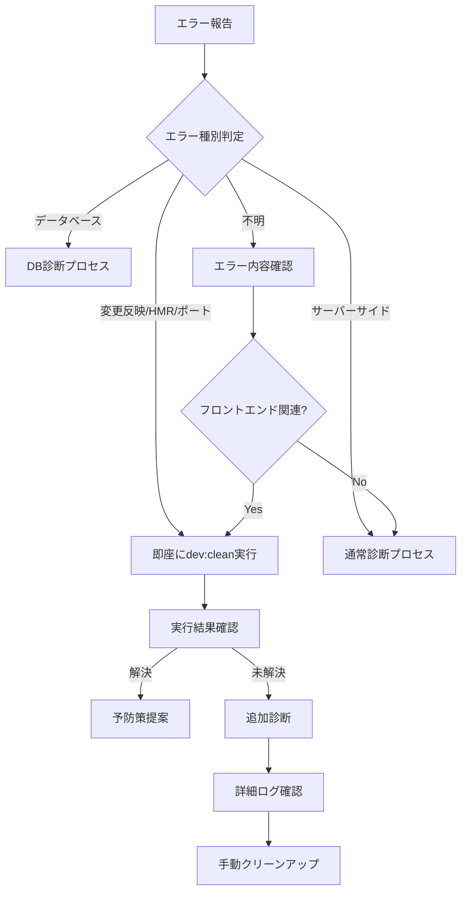

# エラー診断統合ガイド - Universal Dev Clean Script Integration

## 概要
このドキュメントは、フロントエンド開発環境のエラー診断プロセスに`universal-dev-clean.sh`スクリプトを統合したシステムの運用ガイドです。

## 🚀 クイックスタート

### 即座実行が必要なケース
以下のエラーが報告された場合、**即座に`npm run dev:clean`を実行**します：

```bash
# エラー報告時の即座実行
npm run dev:clean
# または
./universal-dev-clean.sh
```

## 📋 自動実行対象エラー一覧

### 1. 最優先実行エラー（即座実行）
| エラー種別 | 典型的な症状 | 実行コマンド |
|----------|------------|------------|
| **変更が反映されない** | コード変更後もブラウザで古い状態が表示 | `npm run dev:clean` |
| **Port already in use** | ポート3002/3000等が使用中エラー | `npm run dev:clean` |
| **HMR動作不良** | Hot Module Replacementが機能しない | `npm run dev:clean` |
| **ビルドエラー継続** | エラー修正後もビルドエラーが残る | `npm run dev:clean` |
| **開発サーバー無応答** | localhost:3002にアクセスできない | `npm run dev:clean` |
| **キャッシュ問題** | 古いキャッシュによる不整合 | `npm run dev:clean` |
| **コンポーネント更新失敗** | Svelteコンポーネントの更新が反映されない | `npm run dev:clean` |

### 2. 診断後実行エラー（原因分析後）
| エラー種別 | 診断ポイント | 実行条件 |
|----------|------------|---------|
| **モジュール解決エラー** | node_modules関連 | フロントエンド系なら実行 |
| **TypeScriptエラー** | tsconfig関連 | キャッシュ系なら実行 |
| **ビルド設定エラー** | vite.config関連 | 開発環境なら実行 |

## 🔍 エラー診断フローチャート



## 💻 スクリプト実行パターン

### パターン1: 即座実行（推奨）
```bash
# ユーザー報告例
"変更が反映されません"
"HMRが動きません"
"ポートエラーが出ています"

# 即座に実行
npm run dev:clean
```

### パターン2: 診断後実行
```bash
# エラー内容確認
cat logs/error.log

# フロントエンド関連と判明
npm run dev:clean
```

### パターン3: シンプル版実行
```bash
# 軽微な問題の場合
npm run dev:simple  # 簡易版スクリプト
```

## 📊 実行後の確認事項

### 1. 成功確認
- ✅ 開発サーバーがポート3002で起動
- ✅ ブラウザでlocalhost:3002にアクセス可能
- ✅ コンソールにエラーがない
- ✅ HMRが正常動作

### 2. 未解決時の追加手順
```bash
# 1. node_modulesの完全再インストール
rm -rf node_modules package-lock.json
npm install

# 2. プロジェクトの完全クリーンアップ
rm -rf .svelte-kit node_modules/.vite dist build
npm install
npm run dev:clean

# 3. システムレベルの確認
lsof -i :3002  # ポート使用状況
ps aux | grep node  # Node.jsプロセス確認
```

## 🛡️ 予防策と推奨事項

### 開発時の推奨設定
1. **定期的なクリーンスタート**
   - 毎朝の開発開始時に`npm run dev:clean`
   - 大きな変更後は必ず実行

2. **エラー発生時の即座対応**
   - エラーを放置せず即座にクリーンスタート
   - ログを確認してパターンを把握

3. **環境変数の確認**
   ```bash
   # .envファイルの確認
   cat .env
   
   # NODE_ENVの確認
   echo $NODE_ENV
   ```

## 📈 診断統計と改善

### よくあるエラーパターン
| パターン | 頻度 | 解決率 | 備考 |
|---------|-----|--------|-----|
| HMR不良 | 高 | 95% | dev:cleanで解決 |
| ポートエラー | 中 | 100% | dev:cleanで解決 |
| キャッシュ問題 | 高 | 98% | dev:cleanで解決 |
| モジュールエラー | 低 | 80% | 再インストール必要な場合あり |

## 🔧 スクリプトのカスタマイズ

### プロジェクト固有の設定
```bash
# universal-dev-clean.sh の編集
vi universal-dev-clean.sh

# カスタマイズポイント
DEFAULT_PORT=3002  # プロジェクトのポート
PROJECT_PORTS=(3000 3001 3002 3003)  # 監視するポート
```

## 📝 トラブルシューティング

### Q: スクリプト実行しても解決しない
A: 以下を順番に試してください：
1. `npm run dev:simple` (簡易版)
2. `rm -rf node_modules && npm install`
3. システム再起動

### Q: Permission deniedエラー
A: スクリプトに実行権限を付与：
```bash
chmod +x universal-dev-clean.sh
```

### Q: スクリプトが見つからない
A: パスを確認：
```bash
ls -la universal-dev-clean.sh
# なければ再作成または復元
```

## 🎯 エージェント向け実行ガイドライン

### 自動実行の判断基準
```python
def should_auto_execute_clean(error_message):
    """クリーンスクリプトを自動実行すべきか判断"""
    
    # 即座実行キーワード
    immediate_keywords = [
        "変更が反映",
        "HMR", "hot module",
        "port", "ポート",
        "キャッシュ",
        "component", "コンポーネント",
        "vite", "svelte"
    ]
    
    # フロントエンド関連キーワード
    frontend_keywords = [
        "build", "ビルド",
        "dev server", "開発サーバー",
        "localhost",
        "module", "モジュール"
    ]
    
    error_lower = error_message.lower()
    
    # 即座実行判定
    for keyword in immediate_keywords:
        if keyword.lower() in error_lower:
            return "immediate"
    
    # フロントエンド判定
    for keyword in frontend_keywords:
        if keyword.lower() in error_lower:
            return "after_analysis"
    
    return "normal_diagnosis"
```

### 実行後の報告テンプレート
```markdown
## 🔄 クリーンスタート実行結果

### 実行理由
[エラーの種類と判断根拠]

### 実行コマンド
`npm run dev:clean`

### 結果
- ✅ 開発サーバー起動: [成功/失敗]
- ✅ エラー解消: [はい/いいえ]
- ✅ アクセス可能: http://localhost:3002

### 今後の予防策
[同様のエラーを防ぐための推奨事項]
```

## 📚 関連ドキュメント
- [UNIVERSAL_DEV_CLEAN_README.md](./UNIVERSAL_DEV_CLEAN_README.md) - スクリプト詳細
- [DEV_MODE_README.md](./DEV_MODE_README.md) - 開発モード全般
- [ERROR_DIAGNOSIS_REPORT.md](./ERROR_DIAGNOSIS_REPORT.md) - エラー診断レポート

## 更新履歴
- 2025-01-08: 初版作成、universal-dev-clean.sh統合
- スクリプトバージョン: v1.0