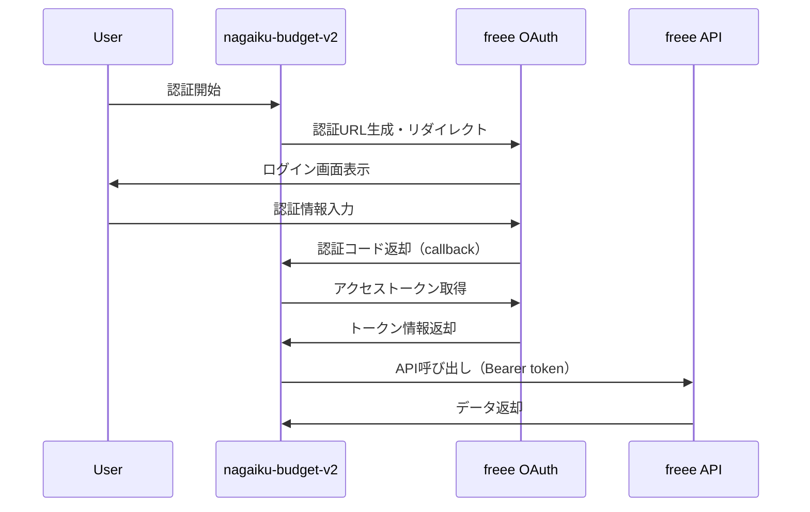
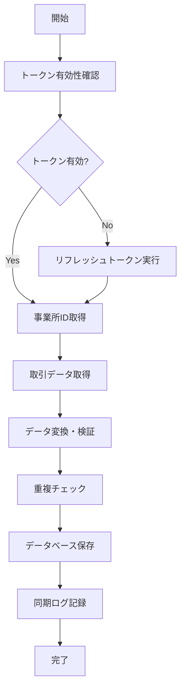

# freee APIデータ読み込み機能 技術仕様書

## 概要

nagaiku-budget-v2プロジェクト向けのfreee会計APIを使用した取引データ読み込み機能の技術仕様書です。OAuth2認証フロー、データ取得、同期処理、エラーハンドリングの詳細を定義します。

## 前提条件

- プロジェクト: SvelteKit + TypeScript + Prisma
- データベース: PostgreSQL
- freee API: 会計API v1
- 認証方式: OAuth2 Authorization Code Grant

## 1. freee API v1 仕様概要

### 1.1 基本エンドポイント

```
認証: https://accounts.secure.freee.co.jp/public_api/
API:  https://api.freee.co.jp/api/1/
```

### 1.2 主要APIエンドポイント

| エンドポイント | 用途 | メソッド |
|---------------|------|----------|
| `/authorize` | OAuth2認証 | GET |
| `/token` | トークン取得・更新 | POST |
| `/companies` | 事業所一覧取得 | GET |
| `/deals` | 取引データ取得 | GET |
| `/walletables` | 明細データ取得 | GET |

### 1.3 レート制限

- **基本制限**: 300リクエスト/分/事業所
- **ファイルアップロード**: 600ファイル/分/事業所
- **推奨**: 直列実行、並列実行時は注意が必要

## 2. OAuth2認証フロー

### 2.1 認証フロー図



### 2.2 トークン仕様

| 項目 | 詳細 |
|------|------|
| アクセストークン有効期限 | 6時間 |
| リフレッシュトークン有効期限 | 90日間（2023年12月変更） |
| スコープ | `read write` |
| トークンタイプ | `Bearer` |

### 2.3 実装詳細

#### 認証URL生成

```typescript
generateAuthUrl(state: string): string {
  const params = new URLSearchParams({
    client_id: this.config.clientId,
    redirect_uri: this.config.redirectUri,
    response_type: 'code',
    scope: 'read write',
    state: state
  });
  return `https://accounts.secure.freee.co.jp/public_api/authorize?${params.toString()}`;
}
```

#### トークン取得

```typescript
async exchangeCodeForToken(code: string): Promise<FreeeToken> {
  const response = await fetch('https://accounts.secure.freee.co.jp/public_api/token', {
    method: 'POST',
    headers: { 'Content-Type': 'application/x-www-form-urlencoded' },
    body: new URLSearchParams({
      grant_type: 'authorization_code',
      client_id: this.config.clientId,
      client_secret: this.config.clientSecret,
      code: code,
      redirect_uri: this.config.redirectUri,
    }),
  });
  // レスポンス処理
}
```

## 3. データ取得フロー

### 3.1 データ取得フロー図



### 3.2 取引データ構造

#### freee API レスポンス

```typescript
interface FreeeTransaction {
  id: number;
  company_id: number;
  issue_date: string;           // 発生日（YYYY-MM-DD）
  due_date: string | null;      // 支払期日
  amount: number;               // 金額
  due_amount: number;           // 支払残高
  type: 'income' | 'expense';   // 収支区分
  partner_name: string | null;  // 取引先名
  details: FreeeTransactionDetail[];
  ref_number: string | null;    // 管理番号
  description: string | null;   // 備考
  receipt_ids: number[];        // 証憑ファイルID
}

interface FreeeTransactionDetail {
  id: number;
  account_item_id: number;      // 勘定科目ID
  account_item_name: string;    // 勘定科目名
  section_id: number | null;    // 部門ID
  section_name: string | null;  // 部門名
  item_id: number | null;       // 品目ID
  item_name: string | null;     // 品目名
  amount: number;               // 金額
  description: string | null;   // 内容
}
```

### 3.3 データ取得パラメータ

| パラメータ | 必須 | 説明 |
|-----------|------|------|
| `company_id` | ○ | 事業所ID |
| `start_issue_date` | × | 発生日開始（YYYY-MM-DD） |
| `end_issue_date` | × | 発生日終了（YYYY-MM-DD） |
| `limit` | × | 取得件数（最大100、デフォルト20） |
| `offset` | × | オフセット |

## 4. データ変換・マッピング仕様

### 4.1 freee → nagaiku-budget-v2 マッピング

| freee | nagaiku-budget-v2 | 変換処理 |
|-------|------------------|----------|
| `id` | `freeDealId` | そのまま |
| `issue_date` | `date` | Date型に変換 |
| `amount` | `amount` | 金額そのまま（円単位） |
| `partner_name` | `supplier` | 取引先名 |
| `description` | `memo` | 備考 |
| `ref_number` | `managementNumber` | 管理番号 |
| `details[0].account_item_name` | `account` | 第1明細の勘定科目 |
| `details[0].description` | `description` | 第1明細の内容 |

### 4.2 複合仕訳の処理

freeeの取引に複数明細がある場合:

1. 第1明細を主取引として登録
2. 第2明細以降は `journalLineNumber` を2,3,... として追加登録
3. 同一 `journalNumber` でグループ化

### 4.3 データ検証ルール

```typescript
const transactionSchema = z.object({
  id: z.string(),
  journalNumber: z.number().positive(),
  journalLineNumber: z.number().positive(),
  date: z.date(),
  amount: z.number(),
  freeDealId: z.number().optional(),
  // その他フィールド
});
```

## 5. 重複チェック・増分取得

### 5.1 重複チェック戦略

1. **freeDealId による重複チェック**
   ```sql
   SELECT COUNT(*) FROM transactions WHERE freeDealId = ?
   ```

2. **複合キーによる重複チェック**
   ```sql
   SELECT COUNT(*) FROM transactions 
   WHERE date = ? AND amount = ? AND supplier = ?
   ```

### 5.2 増分取得実装

```typescript
async syncTransactions() {
  const lastSync = await getLastSyncDate();
  const startDate = lastSync ? formatDate(lastSync) : undefined;
  const endDate = formatDate(new Date());
  
  const transactions = await this.freeeClient.getDeals(
    accessToken,
    companyId,
    startDate,
    endDate
  );
  
  // 重複チェック・データ保存処理
}
```

### 5.3 同期履歴管理

```typescript
interface FreeeSync {
  id: number;
  lastSyncAt: DateTime;
  syncStatus: 'idle' | 'running' | 'success' | 'error';
  syncMessage: string | null;
  recordCount: number;
}
```

## 6. エラーハンドリング

### 6.1 HTTPステータスコード別処理

| ステータス | 説明 | 処理 |
|-----------|------|------|
| 200 | 成功 | 正常処理継続 |
| 400 | リクエストエラー | パラメータ検証・修正 |
| 401 | 認証エラー | トークンリフレッシュ実行 |
| 403 | 権限エラー | エラーログ・管理者通知 |
| 429 | レート制限 | 指数バックオフで再試行 |
| 500 | サーバエラー | 一定時間後再試行 |

### 6.2 リトライロジック

```typescript
async function retryWithBackoff<T>(
  fn: () => Promise<T>,
  maxRetries: number = 3,
  baseDelay: number = 1000
): Promise<T> {
  for (let attempt = 1; attempt <= maxRetries; attempt++) {
    try {
      return await fn();
    } catch (error) {
      if (attempt === maxRetries) throw error;
      
      const delay = baseDelay * Math.pow(2, attempt - 1);
      
      if (error.status === 429) {
        // Retry-Afterヘッダーを確認
        const retryAfter = error.headers?.['retry-after'];
        if (retryAfter) {
          await sleep(parseInt(retryAfter) * 1000);
          continue;
        }
      }
      
      await sleep(delay);
    }
  }
}
```

### 6.3 エラー分類・ログ記録

```typescript
enum FreeeErrorType {
  AUTHENTICATION = 'authentication',
  RATE_LIMIT = 'rate_limit',
  NETWORK = 'network',
  VALIDATION = 'validation',
  SERVER = 'server',
  UNKNOWN = 'unknown'
}

interface FreeeError {
  type: FreeeErrorType;
  message: string;
  statusCode?: number;
  retryable: boolean;
  timestamp: Date;
}
```

## 7. セキュリティ考慮事項

### 7.1 トークン管理

1. **暗号化保存**
   - アクセストークン・リフレッシュトークンはデータベースで暗号化
   - 環境変数での暗号化キー管理

2. **トークンローテーション**
   - リフレッシュ時に新しいリフレッシュトークンを取得・保存
   - 古いトークンは即座に無効化

3. **アクセス制御**
   - トークン操作は管理者権限のみ
   - APIアクセスログの記録

### 7.2 データ保護

1. **通信暗号化**
   - HTTPS必須
   - TLS 1.2以上

2. **ログ管理**
   - 機密情報（トークン、パスワード）のログ出力禁止
   - 操作ログの長期保存

### 7.3 設定管理

```typescript
interface FreeeConfig {
  clientId: string;         // 環境変数から取得
  clientSecret: string;     // 環境変数から取得
  redirectUri: string;      // 検証済みURL
  baseUrl: string;          // 固定値
  encryptionKey: string;    // 暗号化キー
}
```

## 8. 実装構成

### 8.1 ディレクトリ構造

```
src/lib/freee/
├── client.ts              # FreeeAPIClient クラス
├── auth.ts                # OAuth2認証処理
├── sync.ts                # データ同期処理
├── mapper.ts              # データ変換処理
├── error-handler.ts       # エラーハンドリング
└── types.ts               # 型定義

src/routes/api/freee/
├── auth/+server.ts        # 認証API
├── sync/+server.ts        # 同期API
└── status/+server.ts      # 状態確認API

src/routes/auth/freee/
├── +page.server.ts        # 認証ページ
├── callback/+page.server.ts  # コールバック処理
└── status/+page.server.ts    # 状態表示
```

### 8.2 環境変数

```env
# freee API設定
FREEE_CLIENT_ID=your_client_id
FREEE_CLIENT_SECRET=your_client_secret
FREEE_REDIRECT_URI=https://yourdomain.com/auth/freee/callback
FREEE_BASE_URL=https://api.freee.co.jp

# データ暗号化
FREEE_ENCRYPTION_KEY=your_encryption_key
```

### 8.3 データベース更新

既存のスキーマに追加：

```sql
-- freee同期エラーログテーブル
CREATE TABLE freee_error_logs (
  id SERIAL PRIMARY KEY,
  error_type VARCHAR(50) NOT NULL,
  error_message TEXT NOT NULL,
  status_code INTEGER,
  retryable BOOLEAN DEFAULT false,
  context JSONB,
  created_at TIMESTAMP DEFAULT NOW()
);

-- インデックス追加
CREATE INDEX idx_transactions_freee_deal_id ON transactions(freeDealId);
CREATE INDEX idx_freee_error_logs_created_at ON freee_error_logs(created_at);
```

## 9. 実装時の注意点

### 9.1 開発時チェックポイント

1. **認証フロー**
   - stateパラメータによるCSRF対策
   - リダイレクトURIの検証

2. **データ同期**
   - 大量データの分割取得
   - 進行状況の表示

3. **エラーハンドリング**
   - ユーザーフレンドリーなエラーメッセージ
   - 管理者向け詳細ログ

4. **パフォーマンス**
   - データベースクエリの最適化
   - 不要なAPI呼び出しの削減

### 9.2 テスト観点

1. **単体テスト**
   - データ変換ロジック
   - エラーハンドリング
   - 重複チェック

2. **統合テスト**
   - OAuth2フロー
   - API通信
   - データベース操作

3. **E2Eテスト**
   - 認証から同期までの一連の流れ
   - エラーケースでの動作

### 9.3 運用考慮事項

1. **監視**
   - 同期処理の成功/失敗監視
   - API使用量の監視
   - トークン有効期限の監視

2. **保守**
   - ログローテーション
   - 古い同期履歴の削除
   - トークンの定期更新

3. **スケーラビリティ**
   - 複数事業所対応
   - 大容量データ処理
   - 同期処理の並列化

## 10. リリース計画

### Phase 1: 基盤実装
- OAuth2認証フロー
- 基本的なAPI通信
- トークン管理

### Phase 2: データ同期
- 取引データ取得
- データ変換・保存
- 重複チェック

### Phase 3: エラーハンドリング
- リトライロジック
- エラー分類・ログ
- 運用監視

### Phase 4: 最適化
- パフォーマンス改善
- 大容量データ対応
- UI/UX改善

---

## 付録

### A. freee API リファレンス
- [freee Developers Community](https://developer.freee.co.jp/)
- [会計APIリファレンス](https://developer.freee.co.jp/reference/accounting/reference)

### B. 関連ドキュメント
- プロジェクトREADME
- データベーススキーマ定義
- セキュリティガイドライン

---

**作成日**: 2024年8月4日  
**最終更新**: 2024年8月4日  
**バージョン**: 1.0